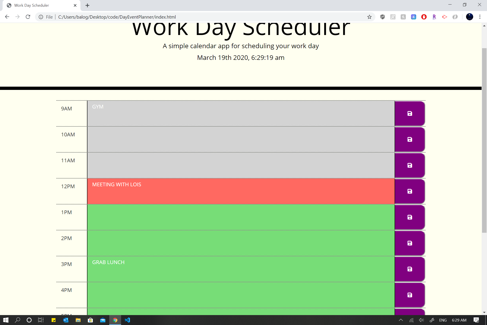

# DayEventPlanner

Created a simple calendar application that allows the user to save events for each hour of the day. This app runs in the browser and features dynamically updated HTML and CSS. Powered by jQuery.

# Link to Webpage

https://toyinbalogun.github.io/DayEventPlanner/

# Demo Screenshot
# Start Page

# Saved Events Page

